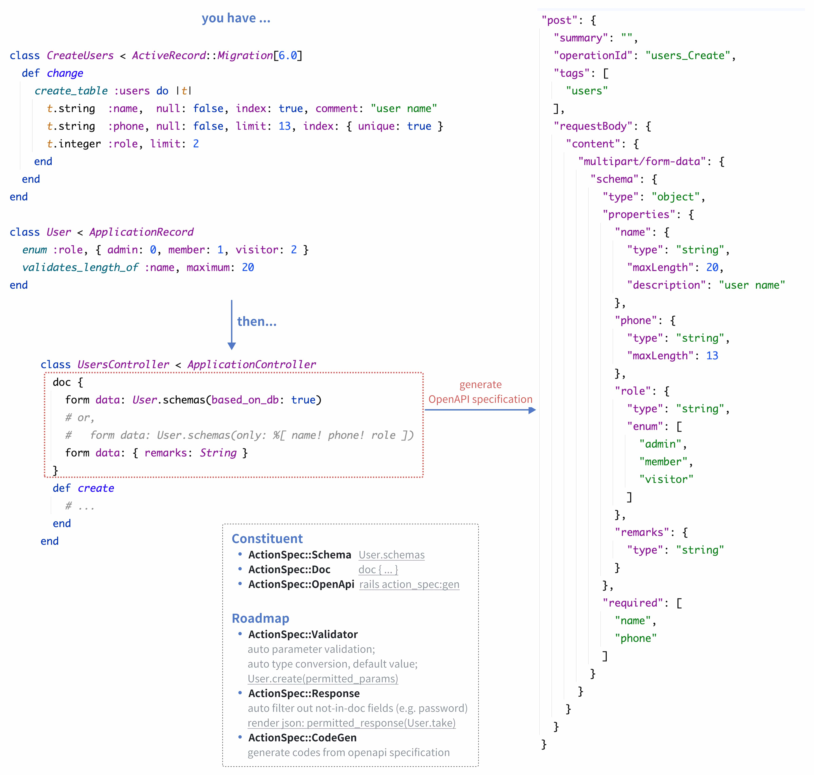

# ActionSpec

Concise and Powerful API Documentation Solution for Rails.



- OpenAPI 版本: `v3.2.0`
- 要求: Ruby 3.1+ 和 Rails 7.0+
- 注意：本项目使用 Codex 花费三个小时实现，尚未人工 review，未在生产环境验证过。（但是已驱使 Codex 生成了比较详细的 Rspec 测试）

## 目录

1. [OpenAPI 生成](#openapi-生成)
2. [Doc DSL](#doc-dsl)
   1. [`doc`](#doc)
   2. [`doc_dry`](#doc_dry)
   3. [`doc` 内的 DSL](#doc-内的-dsl)
      1. [Parameter](#1-parameter)
      2. [request body](#2-request-body)
      3. [`openapi false`](#3-openapi-false)
      4. [Scope](#4-scope)
      5. [response](#5-response)
3. [Schemas](#schemas)
   1. [声明字段为必填项（required）](#1-声明字段为必填项required)
   2. [字段类型](#2-字段类型)
   3. [字段选项](#3-字段选项)
   4. [从 ActiveRecord 生成 Schemas](#4-从-activerecord-生成-schemas)
   5. [类型与边界矩阵](#5-类型与边界矩阵)
4. [参数验证和类型转换](#参数验证和类型转换)
   1. [参数处理流程](#参数处理流程)
   2. [`px` 里的值怎么读](#px-里的值怎么读)
   3. [错误处理](#错误处理)
5. [配置和 I18n](#配置和-i18n)
   1. [配置](#配置)
   2. [I18n](#i18n)
6. [AI 生成风格指导](#ai-生成风格指导)

## 示例

```ruby
class UsersController < ApplicationController
  before_action :validate_and_coerce_params!, only: :create

  doc {
    header :Authorization, String
    path :account_id, Integer
    query :locale, String, default: "zh-CN"
    query :page, Integer, default: -> { 1 }

    form data: {
      name!: String,
      age: Integer,
      birthday: Date,
      admin: { type: :boolean, default: false },
      tags: [String],
      profile: {
        nickname!: String
      }
    }

    response 200, desc: "success"
  }
  def create
    User.create!(
      account_id: px[:account_id], name: px[:name],
      **px.slice(:birthday, :admin, :profile)
    )
  end
end
```

## 安装

```ruby
# Gemfile
gem "action_spec"
```

然后执行：

```bash
$ bundle
```

## OpenAPI 生成

基于当前 Rails 路由和 ActionSpec 的 controller DSL 生成一份 OpenAPI 文档：

```bash
bin/rails action_spec:gen
```

默认会输出到：

```text
docs/openapi.yml
```

也可以用环境变量覆盖默认输出路径和文档元信息：

```bash
bin/rails action_spec:gen \
  OUTPUT=docs/openapi.yml \
  TITLE="My API" \
  VERSION="2026.03" \
  SERVER_URL="https://api.example.com"
```

说明：

1. 只会生成那些已经有对应 `doc` 声明、并且真的挂在 Rails 路由上的 controller action。
2. 如果某个 action 写了 `openapi false`，即使路由存在，也不会生成到文档里。
3. 像 `/users/:id(.:format)` 这样的 Rails 路径，会输出成 `/users/{id}`。
4. 请求参数、请求体、响应描述，会基于当前 DSL 能表达的内容生成。
5. 如果配置和环境变量里都没有提供 `TITLE` 或 `VERSION`，ActionSpec 会使用应用名推导的默认值。

## Doc DSL

### `doc`

`doc` 会自动绑定到后面的实例方法：

```ruby
doc {
  form data: {    # <= request body DSL
    name!: String # <= schema DSL
  }
}
def create
end
```

可以带 summary：

```ruby
doc("创建用户") {
  form data: { name!: String }
}
def create
end
```

如果你希望显式把 action 写出来，也可以这样：

```ruby
doc(:create, "创建用户") {
  form data: { name!: String }
}
def create
end
```

通过 `tag:` 可以覆盖默认的 OpenAPI tag。默认 tag 使用路由对应的 `controller_path`：

```ruby
doc_dry(:index, tag: "backoffice")

doc("用户列表", tag: "members") {
  query :status, String
}
```

生成出来的 OpenAPI operation 还会带上 `operationId`，它会基于最终的 tag 和 action 名组合而成，例如 `members_index` 或 `users_create`。

### `doc_dry`

```ruby
class ApplicationController < ActionController::API
  doc_dry(%i[show update destroy]) {
    path! :id, Integer
  }

  doc_dry(:index) {
    query :page, Integer, default: 1
    query :per, Integer, default: 20
  }
end
```

对应 action 的 dry 声明会先应用，再应用当前 `doc` 自己的声明。

### `doc` 内的 DSL

#### 1. Parameter

```ruby
header  :Authorization, String
header! :Authorization, String

path  :id, Integer
path! :id, Integer

query  :page, Integer
query! :page, Integer

cookie  :remember_token, String
cookie! :remember_token, String
```

bang 方法表示“必填”。例如 `query! :page, Integer` 表示请求里必须传 `page`，并且值不能是 `nil`。如果没有额外声明 `blank: false`，空字符串这类 blank 值仍然允许通过。

如果你不想使用 bang，也可以写 `required: true`：

```ruby
query :page, Integer, required: true
json data: {
  title: { type: String, required: true }
}
```

批量声明参数：

```ruby
in_header(
  Authorization: String
)

in_path!(
  id: Integer
)

in_query(
  page: Integer,
  per: { type: Integer, default: 20 },
  locale: String
)

in_cookie(
  remember_token: String
)

in_query!(
  user_id: Integer,
  token: String
)
```

#### 2. request body

通用形式：

```ruby
body :json, data: { name!: String, age: Integer }
```

便捷方法：

```ruby
json data: { name!: String }
json! data: { name!: String }

form data: { file!: File, position: String }
form! data: { file!: File }
```

单个 multipart 字段：

```ruby
data :file, File
```

说明：

1. 多个 `body/body!`、`json/json!`、`form/form!` 声明时：
   - 同一种 media type 会进行合并，而如果有多种 media type 则 OpenAPI 文档会输出为多种 media type
   - 字段校验和转换时，则不区分 media type（统一从 Rails `params` 中取值）
2. `body!`、`json!`、`form!` 会把根级 request body 标记为必填；如果你不想使用 bang，也可以在 `body`、`json`、`form` 上写 `required: true`。

#### 3. `openapi false`

如果你希望某个 action 不进入 OpenAPI 文档，也可以在 `doc` 或 `doc_dry` 中这样写：

```ruby
openapi false
```

#### 4. Scope

如果你希望把多个位置的字段合并成一个分组视图，可以使用 `scope`：

```ruby
doc {
  scope(:user) {
    query :user_id, Integer
    form data: { name: String }
  }
  form data: { not_in_scope: String }
}
```

运行时可以从 `px.scope` 读取：

```ruby
px.scope[:user] # => { user_id: 1, name: "Tom" }
```

#### 5. response

```ruby
response 200, desc: "success"
response 422, "validation failed"
response 200, :json, data: { code!: Integer, result: Object }

error 401, "unauthorized"
error 503, { code!: Integer, message!: String } # error data schema
error 503, { code: 1000, message: "参数错误" }   # 匿名 error example
error 503, invalid_params: { code: 1000, message: "参数错误" } # 具名 error example
# 批量声明多个具名 example
errors 503, {
  invalid_params: { code: 1000, message: "参数错误" },
  network_error: { code: 1001, message: "网络错误" }
}
errors 503, network_error: { code: 1001 }, upstream_timeout: { code: 1002 } # 也可以不用大括号
```

`response` 元数据会参与 OpenAPI 生成，但暂时不会在运行时自动驱动响应渲染。

说明：

1. `response`、`error`、`errors` 默认使用 `:json` （可配置）作为 `media_type`。
2. 如果只声明了 examples、没有显式声明 schema，ActionSpec 会在生成 OpenAPI 时根据 examples 自动推导响应 schema。

## Schemas

#### 1. 声明字段为必填项（required）

可以写在参数方法上：

```ruby
query! :page, Integer
```

也可以写在对象字段上：

```ruby
json data: {
  name!: String,
  profile: {
    nickname!: String
  }
}
```

`!` 的含义：

1. `query!`、`path!`、`header!`、`cookie!` 表示这个参数本身必填。
2. `name!:`、`nickname!:` 这种写法表示嵌套对象里的字段必填。
3. `body!`、`json!`、`form!` 表示根级 request body 必填。

你也可以用 `required: true` 代替 bang 语法，适用于普通参数、嵌套字段和根级 request body。

在 ActionSpec 里，`required` 的语义是“字段存在，且值不是 `nil`”。它本身不会拦截 blank 字符串；如果你希望 blank 值失败，请使用 `blank: false` 或 `allow_blank: false`。

#### 2. 字段类型

当前 validator/coercer 已支持：

1. `String`
2. `Integer`
3. `Float`
4. `BigDecimal`
5. `:boolean` / `Boolean`
6. `Date`
7. `DateTime`
8. `Time`
9. `File`
10. `Object`

嵌套写法：

```ruby
json data: {
  tags: [String],
  profile: {
    nickname!: String
  },
  settings: { type: Object },
  users: [{ id: Integer }]
}
```

#### 3. 字段选项

```ruby
query :page, Integer, default: 1
query :today, Date, default: -> { Time.current.to_date }
query :status, String, enum: %w[draft published]
query :score, Integer, range: { ge: 1, le: 5 }
query :slug, String, pattern: /\A[a-z\-]+\z/
query :title, String, blank: false # or allow_blank: false

query :nickname, String, transform: :downcase
query :page, Integer, transform: -> { it + 1 }, px: :page_number
query :request_id, String, px_key: :trace_id
```

说明：

1. `transform` 支持传入 `Symbol` 或 `Proc`，会在**类型转换之后**、写入 `px` 之前执行。
2. `px` 和 `px_key` 用来定制参数写入 `px` 时使用的 key 名；`px` 是 `px_key` 的简写。

这些选项仅用于 OpenAPI 文档生成：

```ruby
query :page, Integer, desc: "page number", example: 1, examples: [1, 2, 3]
```

另外，如果 default 等 OpenAPI 选项，无法被转化为 YAML 时（比如 `default: -> { ... }`）），不会将其输出到 OpenAPI 文档中。

#### 4. 从 ActiveRecord 生成 Schemas

如果模型是 `ActiveRecord::Base`，可以直接从模型导出一份可用于 ActionSpec DSL 的 schema hash：

```ruby
class UsersController < ApplicationController
  doc {
    form data: User.schemas
  }
  def create
  end
end
```

`User.schemas` 返回的就是一份可以直接传给 `form data:`、`json data:` 或 `body` 的 hash。

默认会包含模型的全部字段：

```ruby
User.schemas
```

如果只想导出部分字段，可以使用 `only:`：

```ruby
User.schemas(only: %i[name phone role])
```

ActionSpec 会尽量从 ActiveRecord / ActiveModel 中提取和 schema 有关的信息，包括：

1. 字段类型
2. 必填状态，并输出成 `"name!"` 这样的 bang key
3. `enum` 定义
4. `default`
5. 列注释对应的 `desc`
6. format validator 对应的 `pattern`
7. numericality validator 对应的 `range`
8. length validator 和字符串列长度对应的 `length`

输出示例：

```ruby
User.schemas
# {
#   "name!" => { type: String, desc: "user name", length: { maximum: 20 } },
#   "phone!" => { type: String, length: { maximum: 13 }, pattern: /\A1\d{10}\z/ },
#   "role" => { type: String, enum: %w[admin member visitor] }
# }
```

#### 5. 类型与边界矩阵

| 类型 | 可接受输入示例 | 拒绝输入 / 说明 |
| --- | --- | --- |
| `String` | `12`、`true`、`""` | 遵循 `ActiveModel::Type::String`，所以 `true` 会变成 `"t"` |
| `Integer` | `"0"`、`"-12"`、`"+7"`、`12` | 拒绝 `"12.3"`、`"abc"`、`""` |
| `Float` | `"0"`、`"-12.5"`、`12`、`12.5` | 拒绝 `"12.3.4"`、`"abc"` |
| `BigDecimal` | `"0"`、`"-12.50"`、`12`、`12.5` | 拒绝 `"abc"` |
| `:boolean` / `Boolean` | `true`、`false`、`"1"`、`"0"`、`"true"`、`"false"`、`"yes"`、`"no"`、`"on"`、`"off"` | 拒绝含糊值，例如 `""`、`"2"`、`"TRUE "`、`"maybe"` |
| `Date` | `"2025-10-17"` | 拒绝非法日期，例如 `"2025-02-30"` |
| `DateTime` | `"2025-10-17T12:30:00Z"` | 拒绝非法时间，例如 `"2025-10-17 25:00:00"` |
| `Time` | `"2025-10-17T12:30:00Z"` | 遵循 `ActiveModel::Type::Time`，日期部分会变成 `2000-01-01` |
| `File` | `ActionDispatch::Http::UploadedFile`、`Tempfile`、类文件 IO 对象 | 保留原对象，不会把文件内容读进内存 |
| `Object` | `Hash`、`ActionController::Parameters`、任意 Ruby 对象 | 作为标量 `Object` 时原样透传；嵌套 hash 会按对象 schema 递归解析 |
| `[Type]` | 比如 `[Integer]` 接收 `%w[1 2 3]` | 非数组会报错，数组项错误会记录成 `tags.1` 这种路径 |
| 嵌套对象 | `{ profile: { nickname: "neo" } }` | 非 hash 会报错，嵌套字段错误会记录成 `profile.nickname` |


## 参数验证和类型转换

### 参数处理流程

#### `validate_params!`

只做校验，`px` 中保留原始值：

```ruby
before_action :validate_params!
```

例如：

1. 请求进来 `"page" => "2"`
2. DSL 写的是 `query :page, Integer`
3. 结果是 `px[:page] == "2"`

这个 hook 可以安全地写在 base controller 上。如果当前 action 没有匹配的 `doc`，ActionSpec 会跳过校验，并返回一个空的 `px`。

#### `validate_and_coerce_params!`

校验后再做类型转换：

```ruby
before_action :validate_and_coerce_params!
```

例如：

1. 请求进来 `"page" => "2"`
2. DSL 写的是 `query :page, Integer`
3. 结果是 `px[:page] == 2`

这个 hook 也会自动跳过没有匹配 `doc` 的 action，因此放在共享 base controller 上也是安全的。

### `px` 里的值怎么读

`px` 里存的是 ActionSpec 处理后的值。使用 `validate_params!` 时会保留原始值；使用 `validate_and_coerce_params!` 时则是转换后的值。

`px` 是一个 Hash，这也意味着你可以继续使用 `px.slice(...)` 这类 hash 方法，来简化参数取值代码。

```ruby
px[:id]
px[:page]
px[:profile][:nickname]
px.to_h
px.scope[:user]
```

分组视图统一放在 `px.scope` 下面：

```ruby
px.scope[:path]
px.scope[:query]
px.scope[:body]
px.scope[:headers]
px.scope[:cookies]
```

说明：

1. 所有声明在 path/query/body 上的字段，都会同时铺平到顶层 `px[:field]`
2. `scope(:name)` 定义的自定义分组也会出现在 `px.scope[:name]`
3. header 和 cookie 不会作为顶层快捷 key 暴露；例如 `px[:Authorization]` 不能直接读取 header
4. header key 内部会按小写 dashed 形式存储，但读取时兼容 `Authorization`、`HTTP_AUTHORIZATION` 这类原始写法，例如：
   ```ruby
   px.scope[:headers][:authorization]
   px.scope[:headers]["Authorization"]
   px.scope[:headers]["HTTP_AUTHORIZATION"]
   ```
5. 原始 `params` 不会被回写修改

### 错误处理

校验错误会进入 `ActiveModel::Errors`。

校验失败时，ActionSpec 会抛出 `ActionSpec::InvalidParameters`：

```ruby
begin
  validate_and_coerce_params!
rescue ActionSpec::InvalidParameters => error
  error.message
  error.errors.full_messages
end
```

异常对象上也保留了完整结果，可通过 `error.result` 或 `error.parameters` 访问。
ActionSpec 不会帮你渲染默认错误响应，这样每个应用都可以自行决定自己的 rescue 方式和返回格式。

`error.message` 来自 `error.errors.full_messages.to_sentence`，所以会沿用 `ActiveModel::Errors` 的自然语言格式：

1. 单个错误：`"Page is required"`
2. 多个错误：`"Page is required and Birthday must be a valid date"`
3. 如果没有可用的详细错误，则回退为：`"Invalid parameters"`

如果你需要结构化错误详情，用 `error.errors`；如果你只需要一条汇总字符串，用 `error.message`。

## 配置和 I18n

### 配置

```ruby
ActionSpec.configure { |config|
  config.open_api_output = "docs/openapi.yml"
  config.open_api_title = "My API"
  config.open_api_version = "2026.03"
  config.open_api_server_url = "https://api.example.com"
  config.default_response_media_type = :json

  config.error_messages[:invalid_type] = ->(_attribute, options) {
    "should be coercible to #{options.fetch(:expected)}"
  }
}
```

当前可配置项：

1. `invalid_parameters_exception_class`：默认值 `ActionSpec::InvalidParameters`，用来指定校验失败时抛出的异常类型。
2. `error_messages`：默认值 `{}`，用来按错误类型，或者按“字段 + 错误类型”的粒度覆写错误消息。
3. `open_api_output`：默认值 `"docs/openapi.yml"`，用来指定 `bin/rails action_spec:gen` 生成文档时的默认输出路径。
4. `open_api_title`：默认值 `nil`，用来指定 `bin/rails action_spec:gen` 生成的 OpenAPI 文档 `info.title`。
5. `open_api_version`：默认值 `nil`，用来指定 `bin/rails action_spec:gen` 生成的 OpenAPI 文档 `info.version`。
6. `open_api_server_url`：默认值 `nil`，用来指定生成文档里的默认 server URL。
7. `default_response_media_type`：默认值 `:json`，用来指定 `response`、`error`、`errors` 在未显式传入 media type 时使用的默认响应 media type。

### I18n

ActionSpec 基于 `ActiveModel::Errors` 工作，所以你可以覆写消息和字段名：

```yml
zh-CN:
  activemodel:
    attributes:
      action_spec/parameters:
        "profile.nickname": "资料昵称"
    errors:
      messages:
        required: "不能为空"
        invalid_type: "必须是合法的 %{expected}"
```

你也可以直接在 Ruby 里按错误类型或字段覆写消息：

```ruby
ActionSpec.configure { |config|
  config.error_messages[:required] = "不能为空"
  config.error_messages[:invalid_type] = ->(_attribute, options) { "必须是合法的 #{options.fetch(:expected)}" }
  config.error_messages[:page] = {
    required: "页码不能为空"
  }
}
```

## AI 生成风格指导

当你使用 AI 生成 Rails controller 代码，并且涉及参数校验、参数类型转换、参数默认值等情况时，下面这些约定更适合配合 ActionSpec：

1. 使用 `doc { }` 或 `doc("描述") { }`，不要显式写 action name，并且 `doc` 块和 action 方法之间不要留空行
2. `doc` 及其内部统一使用 `{ }` 块，不使用 `do ... end`
3. 对于批量声明的参数，在数量小于等于 3 个，并且没有 hash 嵌套时，优先写成一行，例如：
   - `json data: { type: String, required: true }`
   - `in_query(name: String, value: String)`（优先使用 `in_xxx(...)` 这类批量声明，而不是拆成多行 `xx` DSL）
4. 用 `doc_dry`、`scope` 和 `transform`、`px(px_key)`、`px.slice` 来简化 controller 代码
5. 当接口参数规格与模型层声明一致时，优先使用 `.schemas` 来简化 `doc` 代码

## 当前还没实现的部分

1. 可复用的 `components` 生成
2. `$ref` 生成与去重
3. operation 上的 `description`、`operationId`、`externalDocs`、`deprecated`、`security`
4. parameter 上的 `style`、`explode`、`allowReserved`、`examples`，以及更完整的 header / cookie 序列化控制
5. request body 的 `encoding`
6. 除当前 DSL 直接映射之外的更多 request / response media type
7. response headers
8. response links
9. callbacks
10. webhooks
11. path 级共享 parameters
12. 顶层 `components.parameters`、`components.requestBodies`、`components.responses`、`components.headers`、`components.examples`、`components.links`、`components.callbacks`、`components.schemas`、`components.securitySchemes`、`components.pathItems`
13. 顶层 `security`
14. 顶层 `tags`
15. 顶层 `externalDocs`
16. `jsonSchemaDialect`
17. 超出当前子集的更多 schema 关键字支持，包括对象级约束，以及 `oneOf`、`anyOf`、`allOf`、`not` 这类组合关键字

## 贡献

欢迎提交贡献或问题。

## 许可
本项目以开源方式发布，遵循 [MIT License](https://opensource.org/licenses/MIT)。
